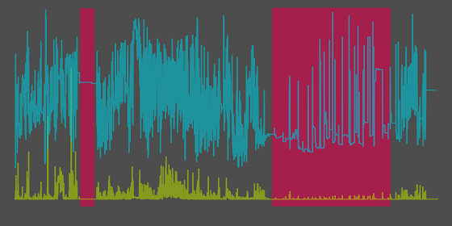

# Child Mind Institute — Problematic Internet Use

This GitHub repo is home to my personal work on a [Kaggle competition: Problematic Internet Use](https://www.kaggle.com/competitions/child-mind-institute-problematic-internet-use/overview).

## Kaggle Competition

The goal of this Kaggle competition is to develop a predictive model that analyzes children's physical activity and fitness data to identify early signs of problematic internet use. Identifying these patterns can help trigger interventions to encourage healthier digital habits.

Current methods for measuring problematic internet use in children and adolescents are often complex and require professional assessments. This creates access, cultural, and linguistic barriers for many families. Due to these limitations, problematic internet use is often not measured directly, but is instead associated with issues such as depression and anxiety in youth.

Conversely, physical & fitness measures are extremely accessible and widely available with minimal intervention or clinical expertise. Changes in physical habits, such as poorer posture, irregular diet, and reduced physical activity, are common in excessive technology users. We propose using these easily obtainable physical fitness indicators as proxies for identifying problematic internet use, especially in contexts lacking clinical expertise or suitable assessment tools.

### Dataset

The [Healthy Brain Network (HBN)](https://childmind.org/) dataset is a clinical sample of about five-thousand 5-22 year-olds who have undergone both clinical and research screenings. The objective of the HBN study is to find biological markers that will improve the diagnosis and treatment of mental health and learning disorders from an objective biological perspective.

Two elements of this study are being used for this competition: physical activity data (wrist-worn accelerometer data, fitness assessments and questionnaires) and internet usage behavior data.

The goal of this competition is to predict from this data a participant's **Severity Impairment Index** (`sii`), a standard measure of problematic internet use.

### Competition timeline

- **September 19, 2024** - **Start Date**.
- December 12, 2024 - Entry Deadline. You must accept the competition rules before this date in order to compete.
- December 12, 2024 - Team Merger Deadline. This is the last day participants may join or merge teams.
- **December 19, 2024** - **Final Submission Deadline**.

## Give it a try locally!

1. Clone this repo
